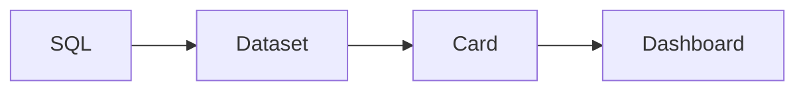

# Lens

[English](README.md) | [中文](README.zh-CN.md)

**Turn SQL into interactive dashboards.**

Lens is a lightweight, open-source BI platform for developers and data teams. Build reusable charts from SQL, explore your metrics, and share dashboards for sales, operations, and growth analysis.

[Get started](docs/getting-started.md) · [Explore the gallery](docs/product.md)

*A retail dashboard built in Lens with synthetic demo data.*

## From SQL to dashboard

Define dimensions and metrics in a dataset, turn them into reusable chart cards, then arrange the cards into a dashboard.

- **SQL-first datasets.** Use read-only SQL to query your data and define the fields for analysis.
- **Flexible dashboards.** Combine KPIs, line and bar charts, rankings, tables, and funnels in a visual layout.
- **Interactive analysis.** Apply dashboard filters and inspect the underlying records behind chart data points when detail viewing is enabled.
- **Team access.** Organize dashboards into groups and control report access by role.

[See the workflow: datasets → cards → dashboards](docs/product.md#define-the-dataset)

More views: English dashboards, dark theme, and mobile

English dashboard examples, light and dark themes, and a responsive layout for checking metrics on the go.

<table>
  <tr><th>English · Dark theme</th><th>Mobile · Scroll to explore</th></tr>
  <tr>
    <td width="75%"></td>
    <td width="25%"></td>
  </tr>
</table>

*Mobile view captured at a phone-sized browser viewport.*

[Explore the full gallery →](docs/product.md)

## Make it yours

Follow the **[getting started guide](docs/getting-started.md)** to run Lens locally. Load the [example dashboards](docs/examples/README.md) to explore and customize the views shown here.

Building with Lens? See the [frontend](frontend/README.md) and [backend](backend/README.md) development docs.

If Lens looks useful, give it a **Star** to follow the project. Ideas and feedback are welcome in Issues.

---

Copyright 2026 tibty · [Apache License 2.0](LICENSE)
