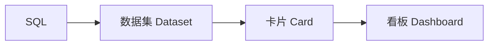

# Lens

[English](README.md) | [中文](README.zh-CN.md)

**从 SQL 到可交互的数据看板。**

Lens 是一个面向开发者和数据团队的轻量级开源 BI 平台。从 SQL 构建可复用的图表，筛选和探索业务数据，搭建经营、销售和增长分析看板。

[开始使用](docs/getting-started.zh-CN.md) · [查看完整演示](docs/product.md)

*使用模拟业务数据，在 Lens 中搭建的零售经营看板。*

## 从查询到看板

在数据集中定义维度与指标，配置成可复用的图表卡片，再组合为业务看板。

- **SQL 定义数据。** 用只读 SQL 查询业务数据，配置用于分析的字段。
- **灵活组合图表。** 将指标卡、折线图、柱状图、排行、表格与漏斗编排到同一张看板。
- **交互式分析。** 使用看板筛选缩小分析范围；开启明细功能后，可点击图表数据查看背后的记录。
- **面向团队使用。** 按业务分组组织看板，按角色开放报表访问权限。

[看看如何搭建：数据集 → 图表卡片 → 看板](docs/product.md#define-the-dataset)

更多展示：亮暗主题与移动端

亮色与暗色主题，适配桌面和手机的看板布局，方便随时查看业务指标。

<table>
  <tr><th>桌面端 · 暗色主题</th><th>移动端 · 滑动查看</th></tr>
  <tr>
    <td width="75%"></td>
    <td width="25%"></td>
  </tr>
</table>

*移动端为手机尺寸的浏览器视口截图。*

[查看完整产品演示 →](docs/product.md)

## 开始搭建你的看板

跟随 **[入门指南](docs/getting-started.zh-CN.md)** 在本地运行 Lens，导入[示例看板](docs/examples/README.md)，就能继续编辑和探索图中的数据。

想参与开发？查看[前端文档](frontend/README.md)与[后端文档](backend/README.md)。

如果 Lens 对你有帮助，欢迎点个 **Star** 关注项目，也欢迎在 Issues 分享想法与反馈。

---

Copyright 2026 tibty · [Apache License 2.0](LICENSE)
