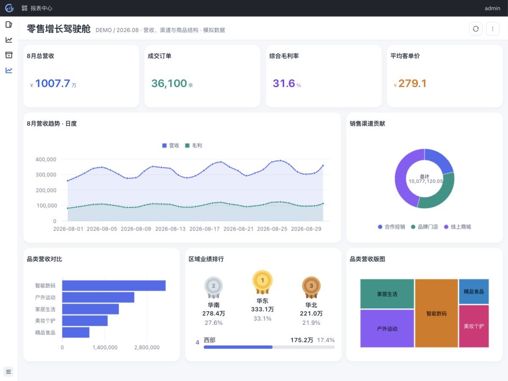
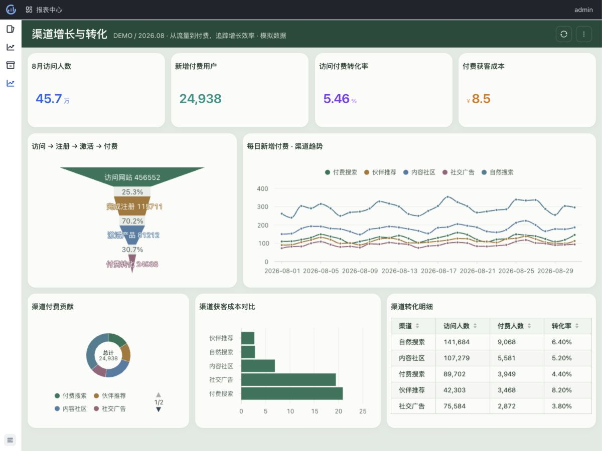
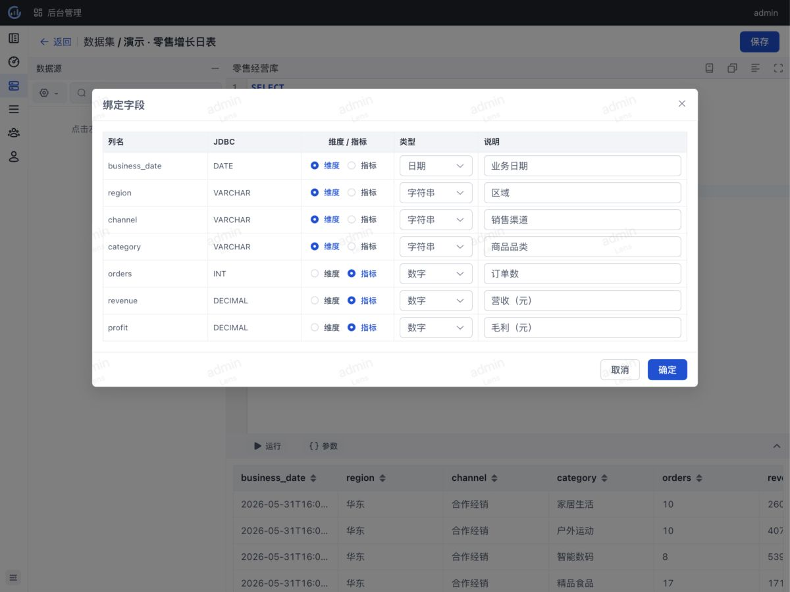
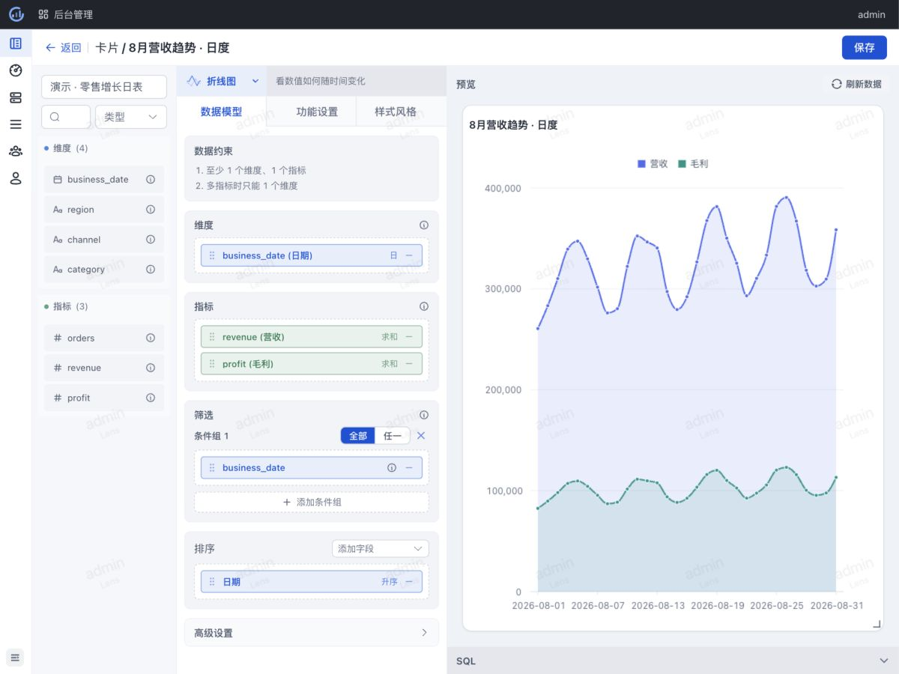
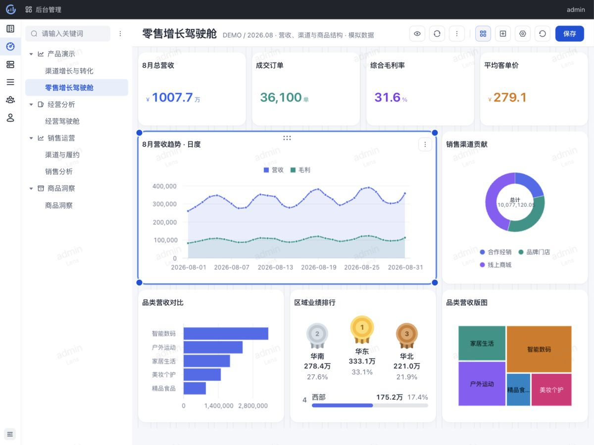
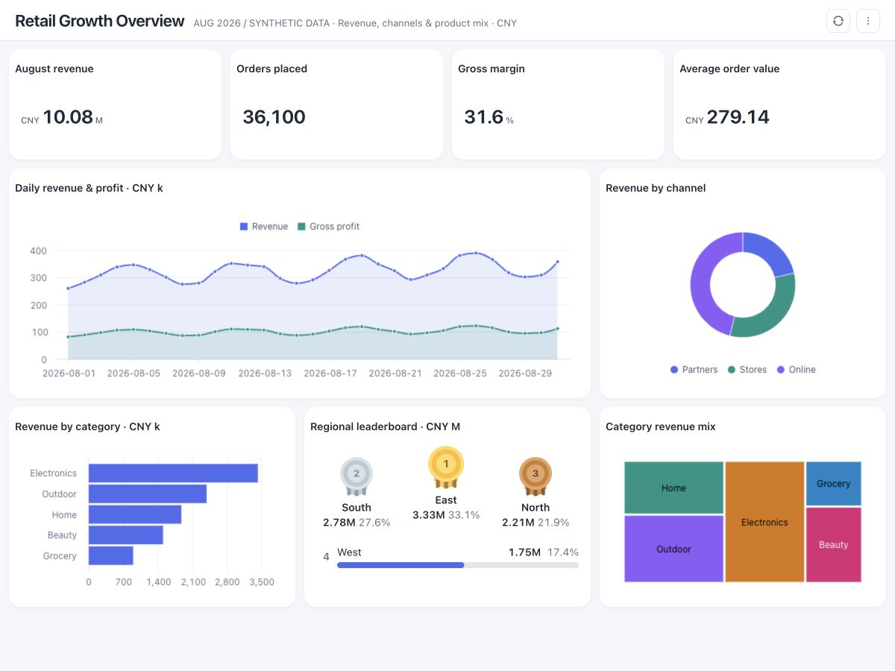
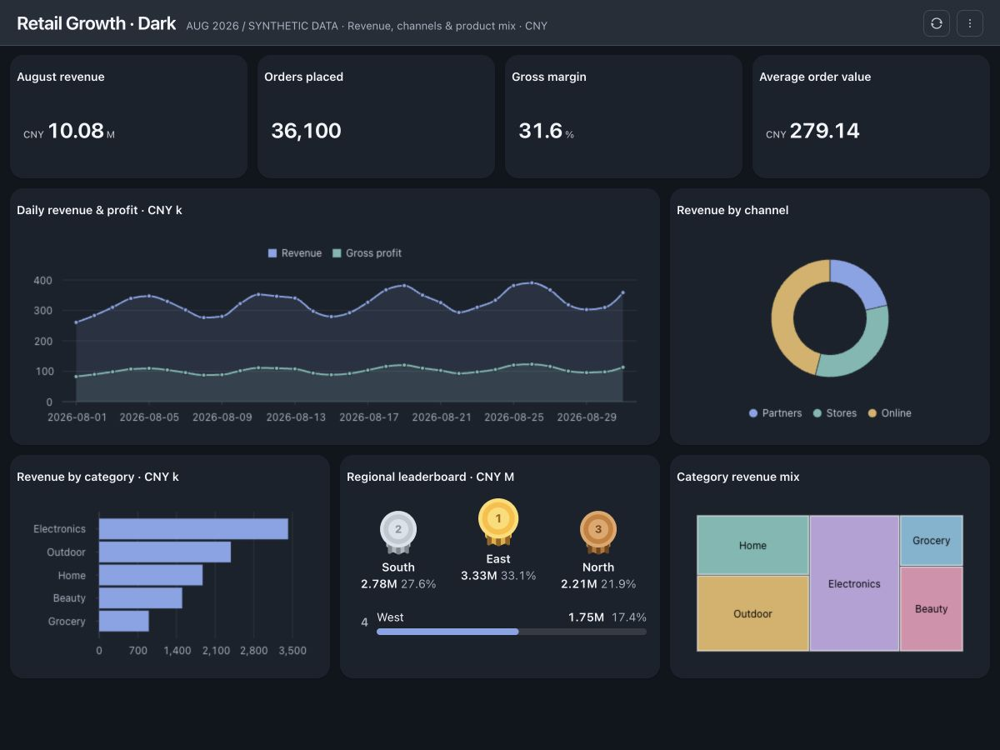
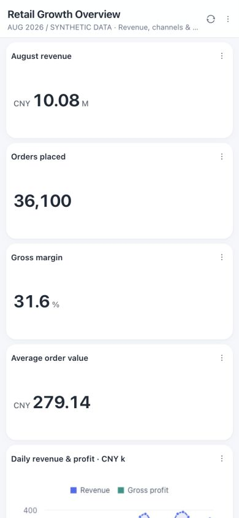
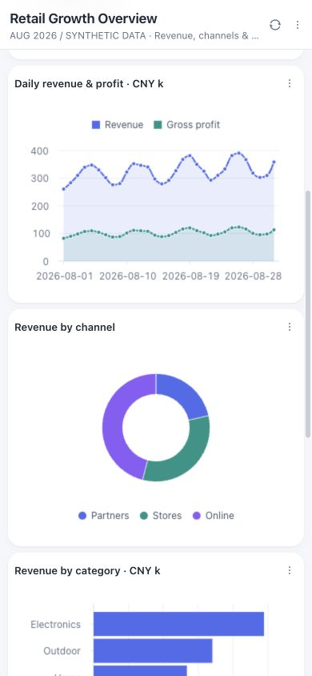

# Lens · Product walkthrough

[← Lens](../README.md) · [中文首页](../README.zh-CN.md) · [Get started](getting-started.md)

SQL datasets → visual cards → dashboards → reports for your team.

Explore retail performance and channel growth, then see how the datasets, charts, and layouts come together. Every screenshot is captured from Lens using **synthetic demo data**.

## Retail growth

See revenue, order volume, gross margin, and average order value together. Daily trends, channel shares, category comparisons, and regional rankings explain where the results come from.

## Channel growth and conversion

Follow visitors through signup, activation, and payment. Compare daily paid-user growth, channel contribution, acquisition cost, and channel detail in one report. Funnel stages and KPI cards use the same daily acquisition data.

## Define the dataset

Run a read-only SQL query, inspect its output, and bind fields as dimensions or metrics. The retail example uses business date, region, channel, and category as dimensions, with orders, revenue, and profit as metrics.

## Build the cards

Choose a dataset and chart type, then drag dimensions and metrics into place. Here, the retail dataset supplies a daily revenue and gross-profit trend, filtered to August 2026. The preview is a real query result.

## Arrange the dashboard

Resize and position cards on a grid. The retail example combines KPI cards, a line chart, a donut chart, a bar chart, a ranking, and a treemap. The same saved cards appear in the report center.

## Filter and inspect

Use dashboard filters to narrow the analysis across configured cards. When detail viewing is enabled, click a chart data point to inspect its underlying records; the detail query retains the card and dashboard filters along with the selected dimension values.

## English dashboard content

The English retail dataset translates region, channel, and category names in SQL. Chart titles, legends, and metric labels are configured in English. Currency remains CNY: `k` denotes thousands and `M` denotes millions. The screenshot comes from the standalone dashboard viewer.

## Dark theme

The separately saved **Retail Growth · Dark** dashboard uses the built-in dark theme. The same nine English cards render with the theme's text, surfaces, axes, and chart colors.

## Mobile portrait view

At a **390 × 844** browser viewport, the English overview changes to a vertical card layout. These are two captures of the same page: headline metrics at the top, then trends and channel analysis after scrolling. This verifies the responsive browser view, rather than a physical handset.

<table>
  <tr><th>Headline metrics</th><th>Charts while scrolling</th></tr>
  <tr>
    <td></td>
    <td></td>
  </tr>
</table>

## Try these examples

Follow the [getting started guide](getting-started.md) to run Lens, then use the [showcase import instructions](examples/README.md#导入) to load these dashboards. The example pack includes **4 datasets, 28 cards, and 4 dashboards**; its data definitions and screenshot reproduction steps live in the [showcase documentation](examples/README.md).

In Lens, open **报表中心 → 产品演示** to find **零售增长驾驶舱**, **渠道增长与转化**, **Retail Growth Overview**, and **Retail Growth · Dark**. The datasets and all 28 cards remain editable in the administration workspace.
