# Lens 产品说明

Lens 是一套轻量 BI 平台：用 SQL 把业务库收成**数据集**，在设计器里做成**卡片**，再拼成**看板**，按角色开放给业务用户。

本文按真实界面讲解主流程。截图来自内置演示数据「启明零售」（全渠道订单，查询基准日 2026-06-15）。

默认账号：`admin` / `Aa123456`。

---

## 1. 它解决什么问题

分析师负责把数准备好、把图做好；业务同学只看自己有权限的报表。中间不再靠导出 Excel、改报表代码。

| 角色 | 主要入口 | 做什么 |
|------|----------|--------|
| 分析师 / 管理员 | 后台管理 | 写数据集、设计卡片、拼看板、管账号权限 |
| 业务用户 | 报表中心 | 看已授权看板，用全局筛选下钻 |

数据从库到报表的路径是：

```text
数据源（只读 JDBC）
    → 数据集（SQL + 字段目录）
        → 卡片（查询模型 + 图表）
            → 看板（布局 + 全局筛选 + 主题）
                → 报表中心（按角色开放）
```

---

## 2. 登录与导航

打开应用后进入登录页。支持记住账号；忘记密码需联系管理员重置。

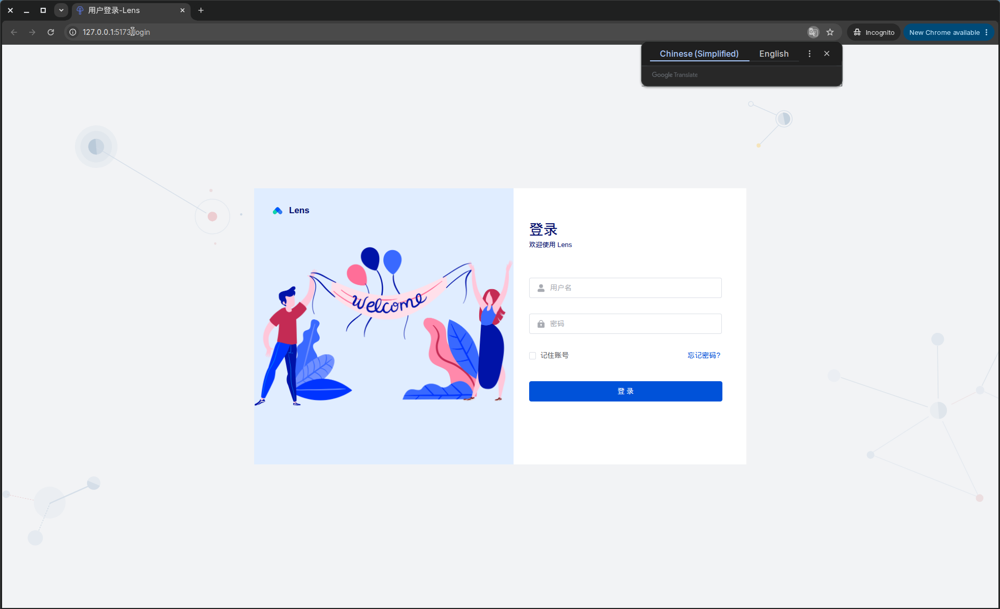

登录后顶栏有两个工作区：

- **报表中心**：业务查看入口。左侧是看板分组树，内容区直接打开看板。管理员默认会先看到已授权的经营看板。
- **后台管理**：配置入口。左侧是数据集、卡片、看板，以及用户、角色、菜单。

顶栏口号会在「让数据更清晰」「看见数据价值」等几句之间轮换。日常工作从顶栏切入即可。

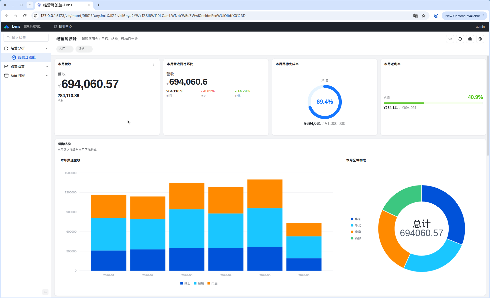

---

## 3. 数据集

数据集是后续所有卡片的数据底座：连上数据源，用一段只读 SQL 定义结果集，再给每列标明类型和角色（维度 / 指标）。

### 3.1 列表

路径：**后台管理 → 数据集**。

可按 ID、名称、状态、备注检索。一行对应一个数据集，演示环境里有：

- **零售订单明细**：`SELECT * FROM dwd_retail_order`，全量订单。
- **零售订单（区域渠道可筛）**：同一张表，SQL 里用模板按大区、渠道、日期收窄，给专题卡用。

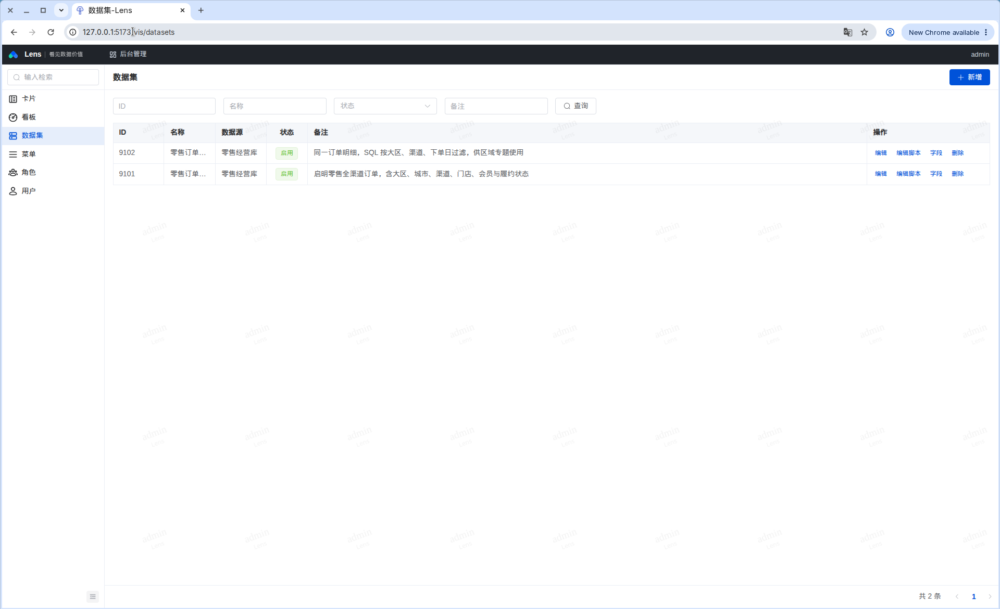

操作：

| 操作 | 作用 |
|------|------|
| 新增 / 编辑 | 填名称、数据源、备注、启用状态 |
| 编辑脚本 | 进入 SQL 工作台 |
| 字段 | 查看已绑定的字段目录 |
| 删除 | 若仍被卡片引用，会列出引用卡并拒绝删除 |

### 3.2 SQL 工作台

左侧是数据源元数据树（库 / 表 / 列），中间是 SQL 编辑器，底部是运行结果。

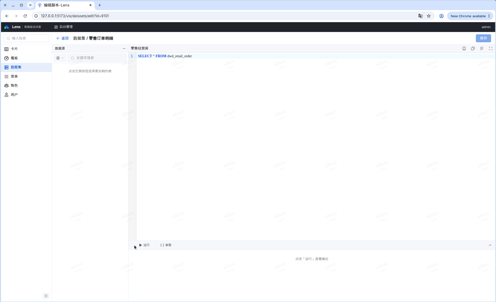

编辑器能力：

- 按库类型补全关键字，按元数据补全表名、列名
- 输入 `#` 可补全模板指令
- 一键格式化、复制、全屏
- **运行**：用当前脚本和调试参数查数
- **参数**：给模板变量填调试值（JSON）
- **模板速查**：查看常量、方法和指令

SQL 不是纯静态语句，而是 **Enjoy 模板**。可以按参数拼条件，避免「一张表写十几段 SQL」。

常用写法：

| 写法 | 含义 |
|------|------|
| `#para(name)` | 绑定成 `?` |
| `#para(list, 'in')` | 展开成 `IN (?,?,…)` |
| `#para(name, 'like')` | 两侧模糊 |
| `#if / #else / #end` | 条件块 |
| `#for(x : list) … #end` | 循环 |
| `#(NOW_TS)` / `#(NOW_DT)` | 当前时间戳 / 日期时间 |
| `#(USER_ID)` | 当前用户 ID |

演示里「零售订单（区域渠道可筛）」就是按 `region`、`channel`、`order_date` 动态拼 `WHERE`。卡片或看板上的参数会灌进这些变量。

运行成功后，用结果列**绑定字段**：确认每列的数据类型（字符串 / 数字 / 日期 / 日期时间）和建议角色（维度 / 指标），并可写备注。字段目录是卡片拖拽建模的来源。

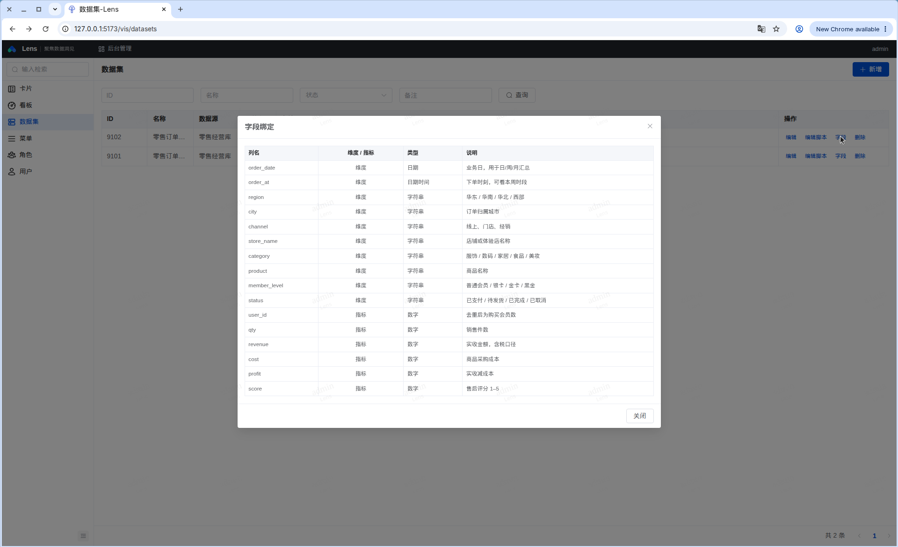

---

## 4. 卡片

卡片是最小可视化单元：选一个数据集，拖字段组成查询，再选一种图表。同一张卡可以挂到多块看板。

### 4.1 列表

路径：**后台管理 → 卡片**。

可按 ID、名称、图表类型、状态检索。演示数据约 30 张卡，覆盖指标、趋势、构成、表格和关系类图表。

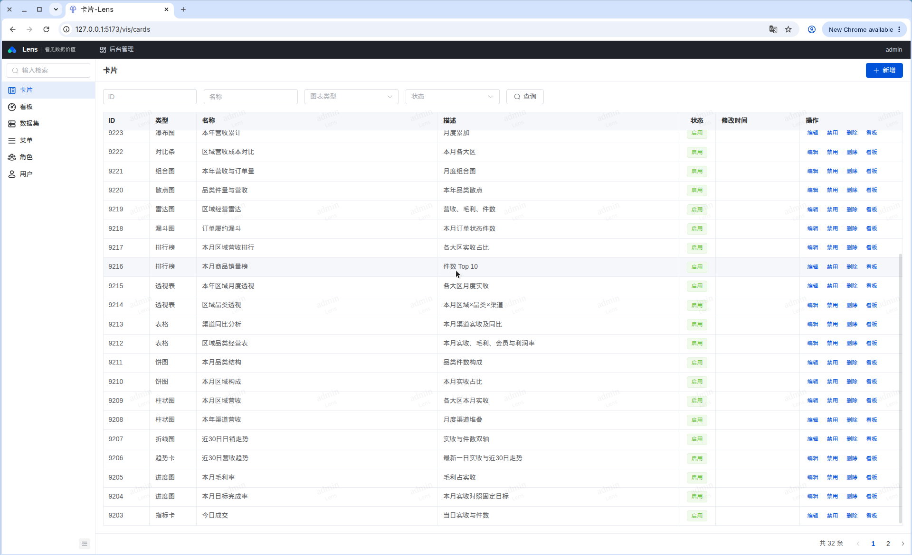

每张卡可以编辑、查看被哪些看板引用、启用 / 禁用、删除。

### 4.2 设计器

设计器分三栏，中间可拖宽：

1. **左侧字段**：选数据集，列出维度和指标，按类型带图标。
2. **中间配置**：选图表类型，再在三个页签里改查询和外观。
3. **右侧预览**：实时出图，可看生成 SQL、打开明细、下载。

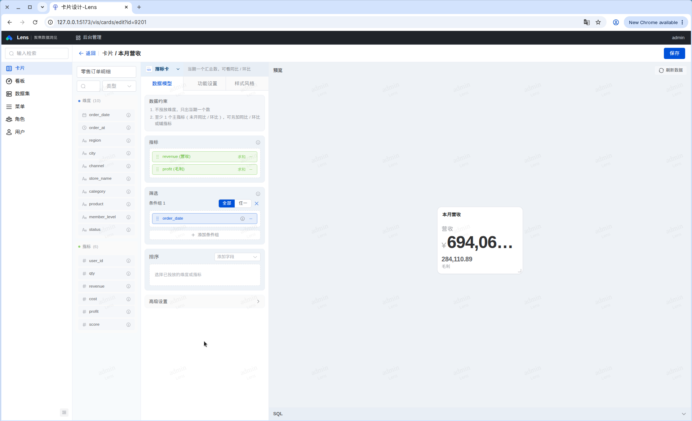

中间三个页签：

| 页签 | 做什么 |
|------|--------|
| 数据模型 | 投放维度、指标、筛选、排序；透视表有行维 / 列维 |
| 功能设置 | 图种相关能力，例如双轴、堆叠、目标值、明细 / 下载开关 |
| 样式风格 | 标题、配色、字号、卡片铬（边框、圆角等） |

### 4.3 数据模型

字段从左侧拖到货架：

- **维度**：分类或时间。日期字段可设粒度：日 / 周 / 月 / 年。
- **指标**：求和、计数、平均、最小、最大、去重计数；也可写公式，例如 `SUM(profit)/SUM(revenue)*100`。
- **同环比**：给指标加对比窗，按日 / 周 / 月 / 年平移，算差值或差值率。
- **筛选**：等值、包含、区间等；日期可用快捷项（今天、本月至今、最近 N 天、今年至今……）。
- **排序 / 行数上限**
- **高级**：基准日（日期快捷和同环比的参照日）、结果过滤（HAVING）、模板参数（灌进数据集 SQL）

指标卡、进度图这类图不需要维度；透视表用行维 × 列维交叉。

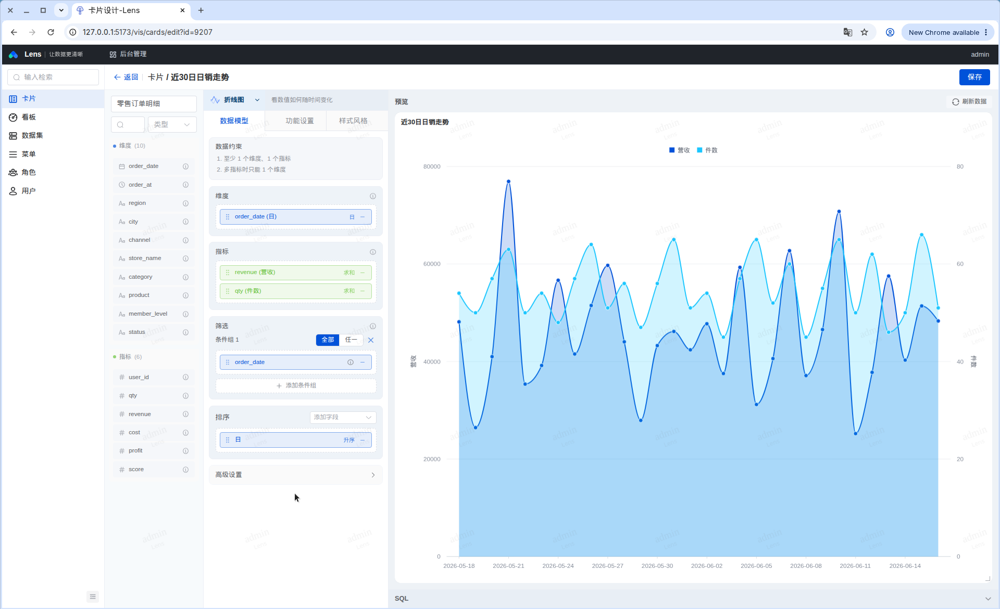

### 4.4 图表类型

按用途分组，选择器里有用途说明：

| 分组 | 类型 | 适合 |
|------|------|------|
| 指标 | 指标卡、趋势卡、排行榜、进度图、KPI 图 | 看当期数、完成率、名次 |
| 对比 | 柱状图、对比条 | 比类别大小，或两个指标对打 |
| 趋势 | 折线图、组合图、瀑布图 | 看随时间变化或累计拆解 |
| 构成 | 饼图、矩形树图 | 看占比和嵌套结构 |
| 关系 | 散点图、热力图、雷达图、漏斗图 | 相关、交叉冷热、转化 |
| 表格 | 表格、透视表 | 明细核对、行列交叉 |
| 其他 | 词云、文本、外链网页 | 关键词、说明文字、嵌入页面 |

静态图（文本、外链）不依赖数据集。文本卡可插入数字、进度和提示，适合写经营口径。

表格支持斑马纹、行号、列筛选、条件着色；透视表支持行小计、行列总计、树形展开。

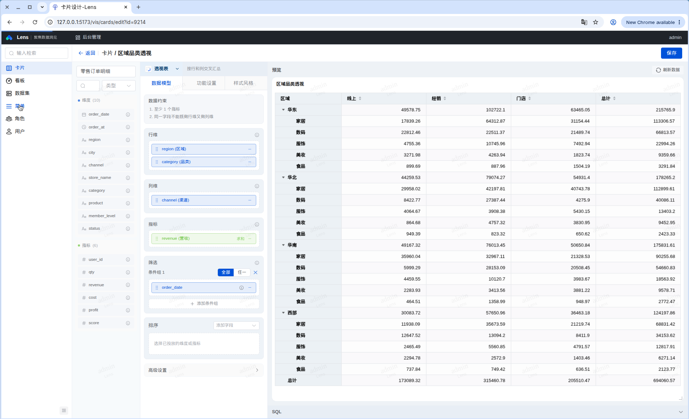

预览区可核对生成 SQL。打开明细会按当前查询下钻到行；允许下载时导出当前结果。

---

## 5. 看板

看板把多张卡片铺到一张画布上，加上全局筛选和主题，给管理层或业务线用。

### 5.1 管理树 + 设计器

路径：**后台管理 → 看板**。

左侧是报表中心树：分组（经营分析、销售运营、商品洞察）和看板。可新增分组 / 看板、改名、改图标、移动、启用或禁用。

右侧是嵌入式设计器：顶栏是标题、筛选条和操作，下面是 24 列网格。

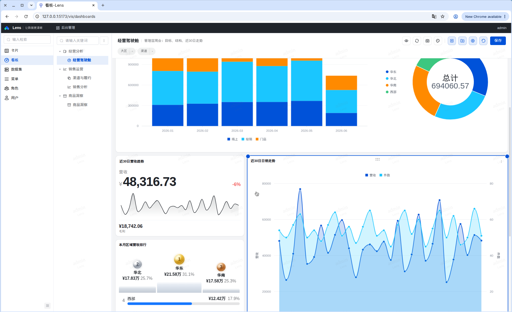

工具栏：

| 操作 | 作用 |
|------|------|
| 添加卡片 | 从已有卡片库勾选放入画布 |
| 添加分组 | 在画布上放一个卡片组（平铺或页签） |
| 看板配置 | 全局筛选、主题、圆角、自动刷新 |
| 刷新 / 重载 | 重新查数，或从库重拉卡片配置 |
| 预览 | 新窗口全屏看 |
| 截图 | 导出当前画布 |
| 保存 | 名称、所属报表分组、图标、描述、启用状态 |

卡片可拖动、缩放。分组里的卡片相对组再排一层网格，适合把「本年渠道堆叠 + 本月区域构成」收成一块「销售结构」。

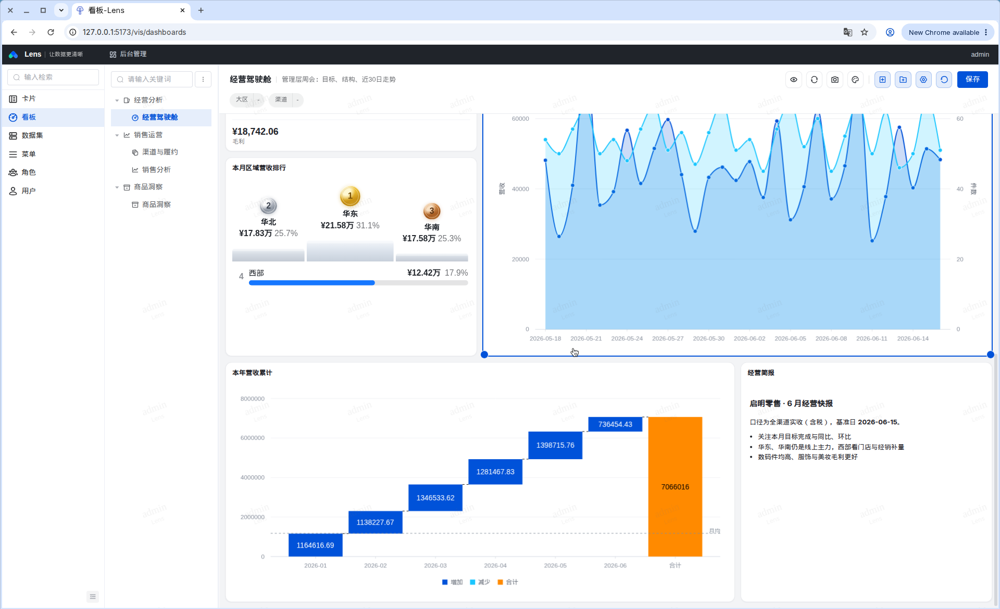

### 5.2 全局筛选

筛选器挂在看板顶栏，一次选择，作用到画布上相关卡片。

两种作用方式：

- **按字段筛选**：在卡片查询上追加条件（例如大区 `IN`）。
- **作为参数**：灌进数据集模板变量（给「区域渠道可筛」这类 SQL 用）。

控件类型包括文本、下拉单选 / 多选、数字区间、日期区间、日期快捷等。选项可手填，也可从数据集字段去重拉取。

演示「经营驾驶舱」顶栏有大区、渠道两个多选；「销售分析」还有下单日快捷和专题大区参数。

### 5.3 主题与刷新

通用配置里可选主题：**默认 / 蓝 / 暖 / 绿 / 紫 / Dark**，以及卡片圆角、自动刷新秒数。预览顶栏也可临时换肤，不写回配置。

### 5.4 全屏预览

预览页没有后台侧栏，只留看板本身和筛选条，适合投影或新窗口对照。

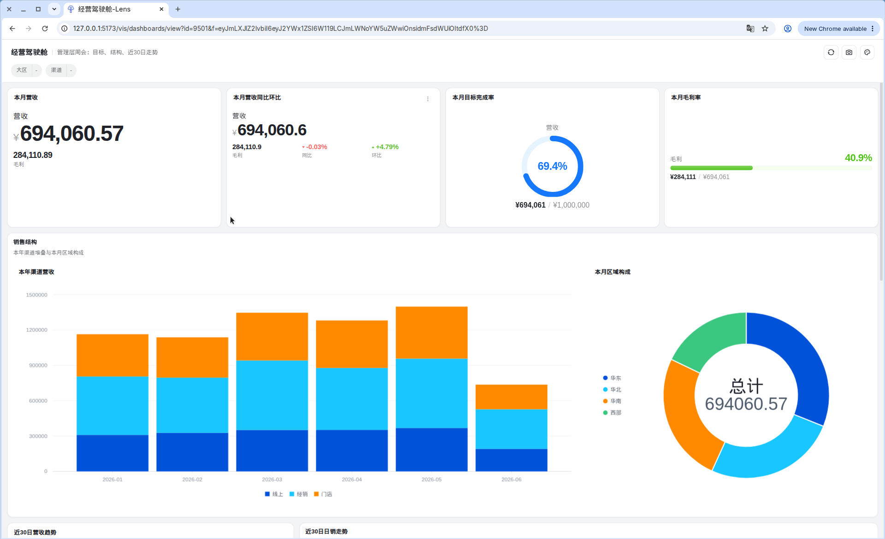

演示里四块看板：

| 看板 | 分组 | 内容 |
|------|------|------|
| 经营驾驶舱 | 经营分析 | 本月营收、同比环比、目标完成、毛利率、渠道堆叠、区域构成、近 30 日走势 |
| 销售分析 | 销售运营 | 区域品类表、透视、渠道同比、月度组合图、专题柱图 |
| 商品洞察 | 商品洞察 | 销量榜、词云、品类饼图、散点、矩形树、瀑布、热力 |
| 渠道与履约 | 销售运营 | 今日成交、区域 / 渠道 KPI、漏斗、对比条、热力、雷达 |

---

## 6. 报表中心

业务用户的日常入口。顶栏切到「报表中心」后，左侧只出现**当前角色被授权**的分组和看板，点开即看，不必进后台。


和设计预览的差别：

- 菜单来自看板分组，路由是 `/vis/report/{看板id}`
- 没有设计按钮，只有查看、筛选、刷新
- 筛选值可以写进 URL，方便分享某一筛选状态

同一套卡片，管理层看驾驶舱，商品同学看商品洞察，互不打扰。

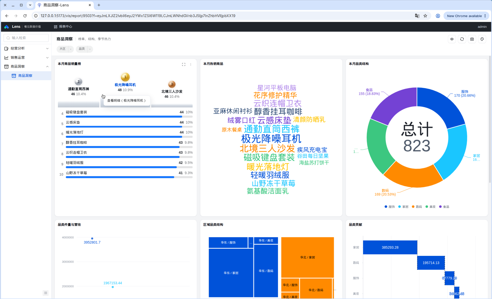

---

## 7. 账号、角色与菜单

路径：**后台管理 → 用户 / 角色 / 菜单**。

### 7.1 用户

维护账号、姓名、状态，给用户挂角色。禁用账号、改密、改角色后，旧登录态会立刻失效（需重新登录）。

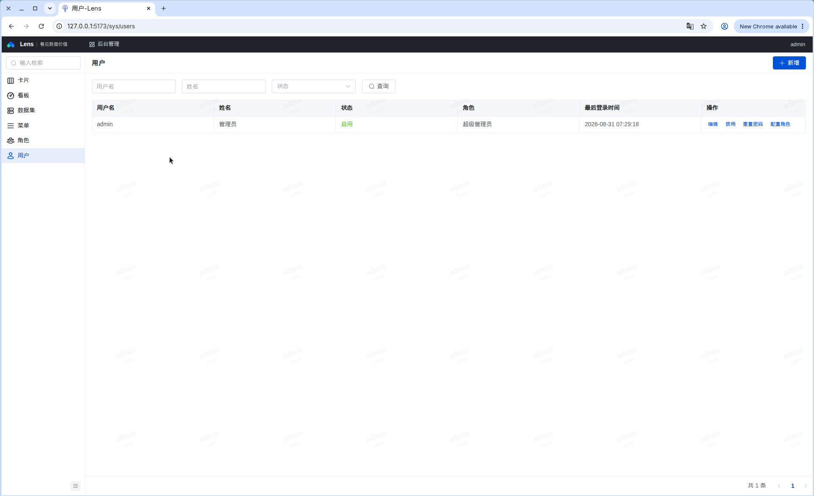

### 7.2 角色

角色管两件事：

1. **功能点**：能不能进数据集 / 卡片 / 看板配置，以及用户、角色、菜单的查看 / 编辑。
2. **看板**：报表中心里能看到哪些看板。按分组树勾选，只存看板 ID。

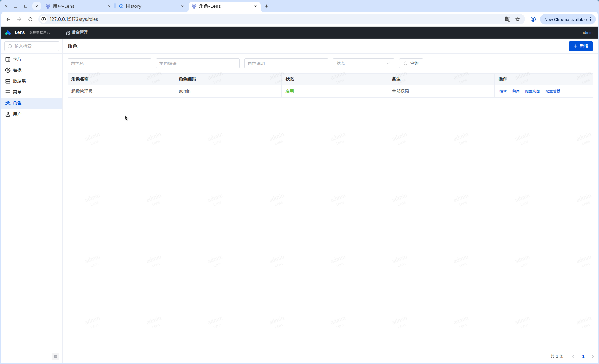

行内「配置功能」勾选菜单权限，「配置看板」勾选该角色在报表中心能看到的看板。

权限码写在登录 token 里。改了功能码后，相关账号需要重新登录才会生效。

常见权限：

| 码 | 含义 |
|----|------|
| `vis:dataset:conf` | 配置数据集 |
| `vis:card:conf` | 配置卡片 |
| `vis:dashboard:conf` | 配置看板 |
| `sys:user:query` / `sys:user:write` | 用户查看 / 编辑 |
| `sys:role:query` / `sys:role:write` | 角色查看 / 编辑 |
| `sys:menu:query` / `sys:menu:write` | 菜单查看 / 编辑 |

没有配置权限的账号，仍可在报表中心看被授权的看板。

### 7.3 菜单

后台侧栏和功能点在菜单里维护：目录、页面路径、图标、排序、权限码。报表中心本身是虚拟根，不入库，随看板分组自动生成。

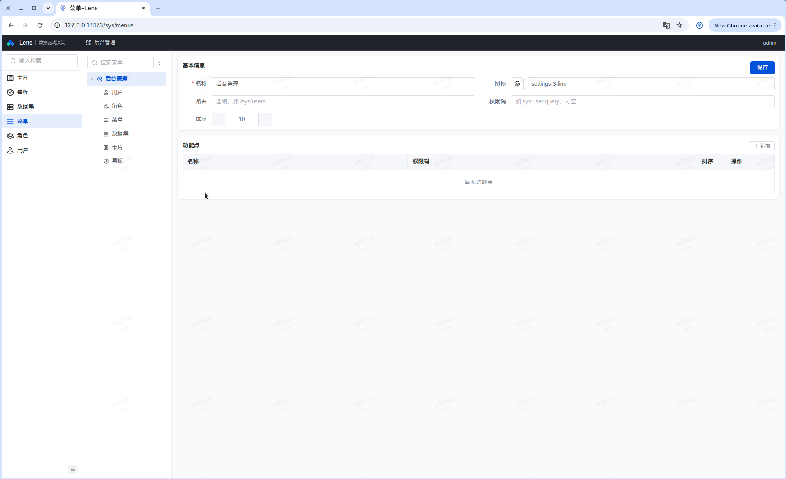

---

## 8. 推荐搭建顺序

从零做一块业务看板，建议按这个顺序，避免「先画图再找数」：

1. **接数据源**  
   只读账号连业务库（演示库即 `lens` 里的零售订单表）。

2. **建数据集**  
   先写能跑通的 SQL，运行确认列，再绑定字段。需要看板参数收窄时，用 `#if` + `#para` 做成模板。

3. **做卡片**  
   一张卡只回答一个问题。指标卡看当期，折线看趋势，表格看明细。日期筛选尽量用「本月至今」「最近 30 天」，并设好基准日，同环比才一致。

4. **拼看板**  
   先放 KPI 条，再放结构图和明细。相关图放进分组。顶栏只留真正跨卡的筛选（大区、渠道、日期）。

5. **授权**  
   角色勾选功能点和看板。业务账号只开报表中心即可。

6. **预览验收**  
   用全屏预览看一屏信息密度，换几个筛选值确认卡片都会动。

---

## 9. 演示数据说明

执行 `backend/db/demo.sql` 后，会写入虚构主体「启明零售」：

- 明细表 `dwd_retail_order`：约 2 万行，覆盖 2024-01 至 2026-08，大区（华东 / 华南 / 华北 / 西部）、渠道（线上 / 门店 / 经销）、五品类商品
- 数据集 2 个、卡片 32 张、看板 4 块
- 查询基准日固定为 **2026-06-15**（周一），所以「本月」「近 30 日」都落在 6 月中旬，截图可复现

适合用来走通：指标卡同比环比、日期快捷、看板全局筛选、SQL 模板参数、透视表和多种图表。

---

## 10. 和开发文档的关系

本文讲**产品怎么用**。安装、启动、接口和目录结构见仓库根目录 [README.zh-CN.md](../README.zh-CN.md)，以及 [frontend/README.md](../frontend/README.md)、[backend/README.md](../backend/README.md)。
